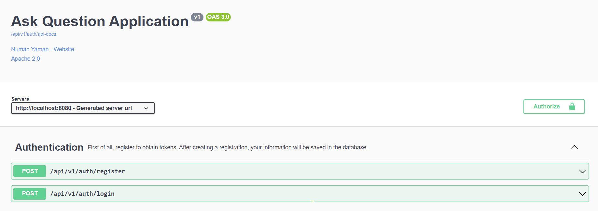
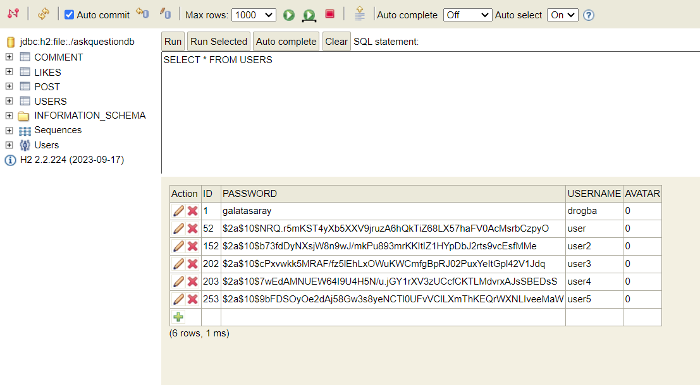
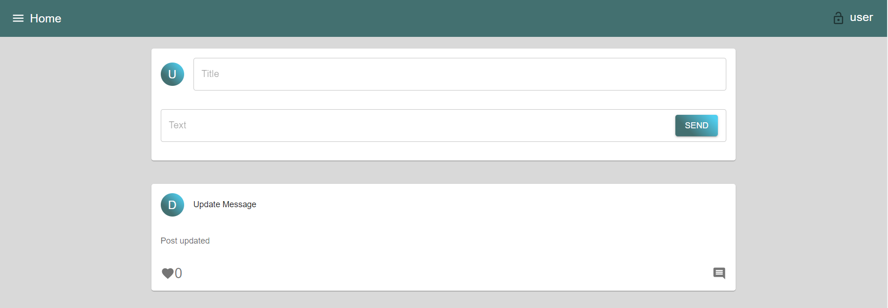
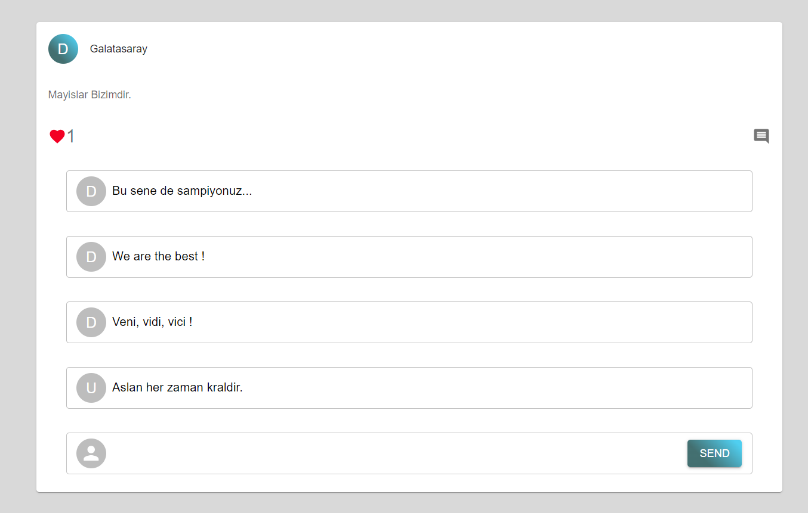
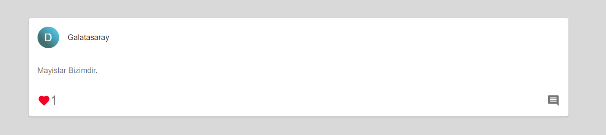
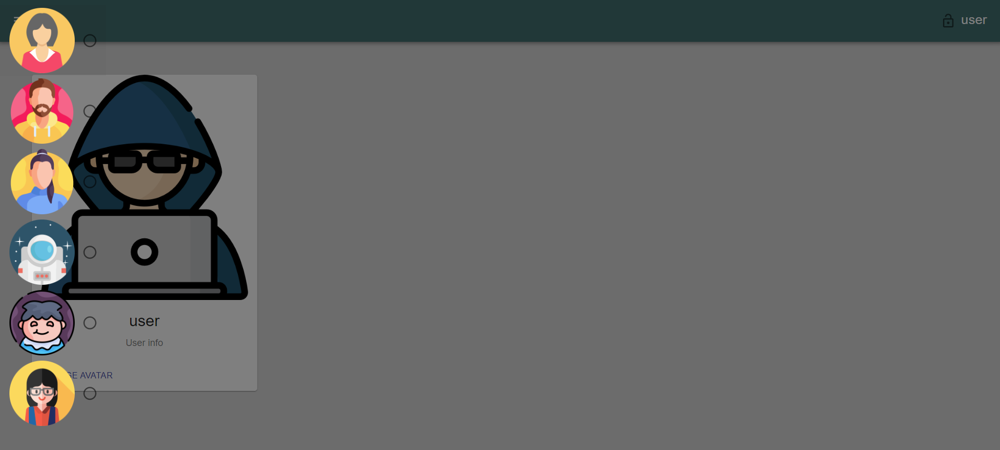

# Ask Question

In this project, you can post, comment and like the posts you like. You can register and log in as a user. If you are registered but not logged in, you can only see the posted posts. You cannot comment or like. After logging in, you can access your profile page if you wish. You can change your avatar here.


## Tech Stack

**Frontend:** React, MaterialUI

**Backend:** Java, Spring Boot


## Installation


```bash
  git clone https://github.com/yamanNuman/ask-question-app-spring.git
```
Let's then import the project we cloned into our IDE.
Then let's run our project. Then let's run the necessary commands in the terminal.
```bash
  cd frontend
  npm install
  npm start
```
Spring Boot -> http://localhost:8080

React -> http://localhost:3000

    
## Documentation

## First Step - User registration

1 - You can post for user registration using the Swagger UI.
```bash
http://localhost:8080/api/v1/auth/swagger-ui
```

2- If you want to register with any API Tester. You can send a request via this URL.
```bash
http://localhost:8080/api/v1/auth/register
```


3- You can also complete your registration by clicking the register button on the start page on the frontend.


## Second Step - Authentication and Jwt Token

1 - You can post for user login using the Swagger UI. Here you can obtain the token and enter the token by clicking the authorize button. You can then request other APIs.
```bash
http://localhost:8080/api/v1/auth/swagger-ui
```


2 - In any API tester, we must first send a request to the given url and get tokens. We need to send username and password in the request body.

```bash
http://localhost:8080/api/v1/auth/login
```

```bash
{
  "username": "string",
  "password": "string"
}
```

You can view previously saved users. 
For this we need to login to H2 Database.

```bash
http://localhost:8080/api/v1/auth/h2
Username = root
Password = root
```



After completing these steps successfully, let's talk about what we can do within the application.


## Let's login first

When the application runs, let's login by clicking the login button on the next page.


## Post
There is a form to post on the page that appears after logging in.



## Comment
You can comment by clicking the comment button at the bottom right of the posts.



## Like
You can like the posts by pressing the heart button at the bottom left. Posts you like will appear as a red heart.



## Profile and Logout

You can access your profile page by clicking on the username that appears on the far right side of the navbar. You can change your avatar here. You can also log out by clicking the logout button next to username.



## API Reference

#### Authentication

```http
  POST /api/v1/auth/login
  POST /api/v1/auth/register
```

| Parameter | Type     | Description                |
| :-------- | :------- | :------------------------- |
| `username` | `string` | **Required**. |
| `password` | `string` | **Required**. |

#### User

```http
  GET /api/v1/users
  GET /api/v1/user/{id}
```

| Parameter | Type     | Description                       |
| :-------- | :------- | :-------------------------------- |
| `id`      | `Integer` | **Required**. |

#### Post

```http
  GET /api/v1/posts
  GET /api/v1/post/{id}
```

| Parameter | Type     | Description                       |
| :-------- | :------- | :-------------------------------- |
| `id`      | `Integer` | **Required**. |

```http
  POST /api/v1/post/{userId}
```

| Parameter | Type     | Description                       |
| :-------- | :------- | :-------------------------------- |
| `userId`      | `Integer` | **Required**. |
| `text`      | `String` | **Required**. |
| `title`      | `String` | **Required**. |

#### Comment

```http
  GET /api/v1/comments/{postId}/{userId}
  
```
| Parameter | Type     | Description                       |
| :-------- | :------- | :-------------------------------- |
| `postId`      | `Integer` | **Required**. |
| `userId`      | `Integer` | **Required**. |

```http
  POST /api/v1/comment/{postId}/{userId}
  
```
| Parameter | Type     | Description                       |
| :-------- | :------- | :-------------------------------- |
| `userId`      | `Integer` | **Required**. |
| `postId`      | `Integer` | **Required**. |
| `text`      | `String` | **Required**. |

#### Like

```http
  GET /api/v1/likes/{postId}
  
```
| Parameter | Type     | Description                       |
| :-------- | :------- | :-------------------------------- |
| `postId`      | `Integer` | **Required**. |

```http
  POST /api/v1/like/{postId}/{userId}
  
```
| Parameter | Type     | Description                       |
| :-------- | :------- | :-------------------------------- |
| `postId`      | `Integer` | **Required**. |
| `userId`      | `Integer` | **Required**. |

```http
  DELETE /api/v1/like/{userId}
```
| Parameter | Type     | Description                       |
| :-------- | :------- | :-------------------------------- |
| `userId`      | `Integer` | **Required**. |


## License

[Apache 2.0](https://www.apache.org/licenses/LICENSE-2.0)

